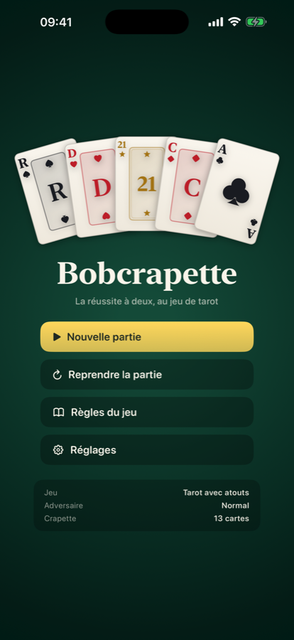
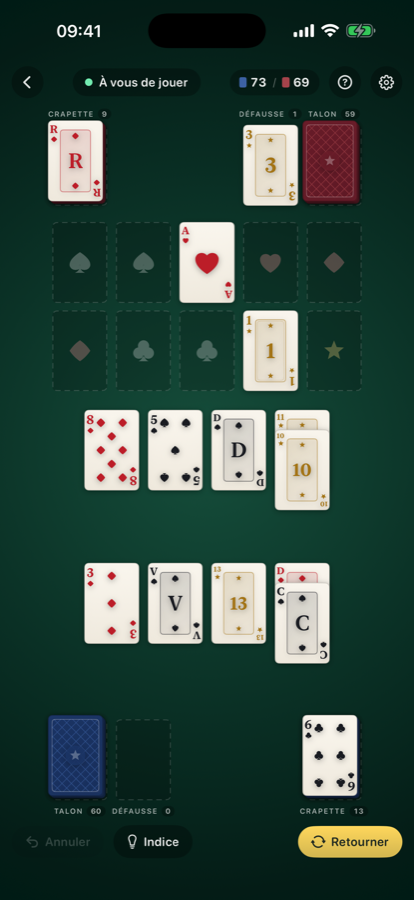

# Bobcrapette

[](https://github.com/boboul-cloud/Bobcrapette/actions/workflows/ci.yml)

La **crapette au jeu de tarot**, contre un adversaire artificiel, en application
native pour **iPhone, iPad et Mac**. Un seul projet SwiftUI, une seule cible,
trois plateformes.

🃏 [Site du jeu](https://boboul-cloud.github.io/Bobcrapette/) ·
📖 [Assistance et règles](https://boboul-cloud.github.io/Bobcrapette/assistance.html) ·
🔒 [Confidentialité](https://boboul-cloud.github.io/Bobcrapette/confidentialite.html) ·
📄 [Conditions](https://boboul-cloud.github.io/Bobcrapette/conditions.html)

<p>
  
  
</p>

## La variante jouée

Chaque joueur apporte son jeu de tarot de **77 cartes** : les quatre couleurs de
l'As au Roi avec le **Cavalier** intercalé entre le Valet et la Dame (14 rangs),
plus les **21 atouts** qui forment une cinquième famille. L'Excuse est écartée.

- **Fondations** : dix piles au centre, deux par famille, montées sans trou — de
  l'As au Roi pour les couleurs, de l'atout 1 à l'atout 21 pour les atouts.
- **Colonnes** : huit piles communes, descendantes en alternant rouge et noir. Un
  atout ne se pose que sur un atout de rang immédiatement supérieur ; on ne
  mélange jamais atouts et couleurs. Une colonne vide accueille n'importe quelle
  carte.
- **Coups offensifs** : on peut charger la crapette ou la défausse de l'adversaire
  d'une carte de la même famille et de rang voisin.
- **Obligations** : poser un As ou l'atout 1 disponible ; monter sur une fondation
  la carte retournée de sa propre crapette. Terminer son tour sans l'avoir fait
  vaut un **« Crapette ! »** : on passe la main sans retourner de carte.
- **Victoire** : le premier qui n'a plus ni crapette, ni talon, ni défausse.

Le règlement complet est consultable dans l'application (bouton `?`) et
[sur le site](https://boboul-cloud.github.io/Bobcrapette/assistance.html).

Les variantes **tarot sans atouts** (56 cartes) et **jeu de 52 classique** sont
disponibles dans les réglages : le moteur de règles est piloté par le nombre de
rangs et d'atouts, rien d'autre ne change.

## Ouvrir le projet

Le projet Xcode est versionné, il suffit de l'ouvrir :

```sh
open Bobcrapette.xcodeproj
```

Il est décrit par `project.yml` et régénéré avec
[XcodeGen](https://github.com/yonaskolb/XcodeGen) après tout ajout de fichier :

```sh
xcodegen generate
```

## Construire et tester

```sh
# Mac
xcodebuild build -scheme Bobcrapette -destination 'platform=macOS'

# iPhone / iPad
xcodebuild build -scheme Bobcrapette -destination 'platform=iOS Simulator,name=iPad Pro 13-inch (M5)'

# Les tests du moteur et de la conduite de partie
xcodebuild test -scheme Bobcrapette -destination 'platform=macOS'

# Les tests d'interface : ils tapent et glissent vraiment sur le simulateur
xcodebuild test -scheme BobcrapetteUI -destination 'platform=iOS Simulator,name=iPhone 17'
```

En `DEBUG`, deux arguments de lancement aident à la mise au point : `-startGame`
ouvre directement une partie sans passer par le menu, et `-seed 74` rejoue une
donne connue. Les tests d'interface s'en servent pour travailler sur un tapis
parfaitement reproductible.

## Signature

Le projet est en **signature automatique** sur l'équipe `38DQ8FW23J`, avec le
certificat *Apple Development* du trousseau. Simulateur, Mac et appareil réel
sont signés et se lancent directement. Pour construire en ligne de commande vers
un iPhone branché :

```sh
xcodebuild build -scheme Bobcrapette -destination 'generic/platform=iOS' -allowProvisioningUpdates
```

Pour signer avec un autre compte, remplacer `DEVELOPMENT_TEAM` dans
`project.yml` puis relancer `xcodegen generate`.

## Organisation

| Dossier | Contenu |
| --- | --- |
| `Bobcrapette/Model` | Le jeu, sans une ligne d'interface : cartes, variantes, position, **moteur de règles**, adversaire artificiel, conduite de la partie, sauvegarde. |
| `Bobcrapette/Views` | Le rendu : cartes dessinées en vectoriel, plan du tapis, plateau, écrans de menu, de réglages et de règles. |
| `BobcrapetteTests` | 45 tests : composition du jeu, fondations, colonnes, coups offensifs, obligations, déroulement d'un tour, adversaire, conduite de partie et plan du tapis. |
| `BobcrapetteUITests` | 6 tests d'interface sur simulateur : tape pour choisir, tape pour jouer, glisser-déposer, avertissement de coup obligatoire. |
| `docs/` | Le site publié par GitHub Pages : présentation, confidentialité, conditions, assistance. |
| `store/` | Le dossier de soumission App Store : fiche, captures aux formats exigés, étiquette de confidentialité, notes de revue, feuille de route. |
| `Tools/MakeIcon.swift` | Génère l'icône de l'application en CoreGraphics. |

Quelques partis pris :

- **Aucune image.** Cartes, enseignes, figures, atouts et dos sont des tracés
  vectoriels, nets de l'iPhone au Mac et sans un octet d'asset.
- **Le plan du tapis est calculé en « largeurs de carte »**, puis mis à l'échelle.
  Trois pliages existent (paysage, carré, portrait) et l'application retient celui
  qui donne les plus grandes cartes sur l'écran courant.
- **Les cartes sont posées en coordonnées absolues** avec `position`, qui place
  réellement la vue : le cadre suit le dessin, donc les touches et l'accessibilité
  aussi. Quand la position change, SwiftUI interpole : distribution et coups
  s'animent sans code d'animation par carte.
- **Une carte, un seul geste.** Tape et glissement sortent du même reconnaisseur,
  mesuré dans le repère fixe du tapis, jamais dans celui de la carte qui bouge.
- **Le moteur de règles est pur et sans état**, donc directement réutilisable par
  l'IA et testable sans interface.

## Vie privée

Bobcrapette ne collecte **aucune donnée**, ne contient aucun code réseau, aucune
publicité, aucun traqueur et aucun kit tiers. La partie en cours, les réglages et
les statistiques restent dans l'espace privé de l'application sur l'appareil.
Voir la [politique de confidentialité](https://boboul-cloud.github.io/Bobcrapette/confidentialite.html).

## Licence

© 2026 Robert Oulhen. **Tous droits réservés.** Ce dépôt est publié à titre de
consultation ; aucune licence d'utilisation, de copie ou de redistribution n'est
accordée. Voir [`LICENSE`](LICENSE).

La crapette est en revanche un jeu traditionnel qui n'appartient à personne : ses
règles sont libres. Seule cette mise en œuvre est protégée.
